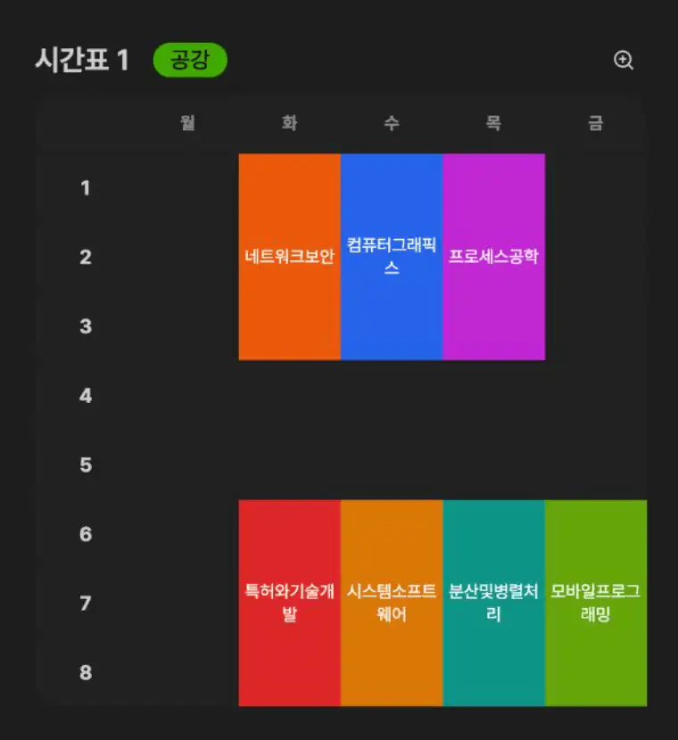
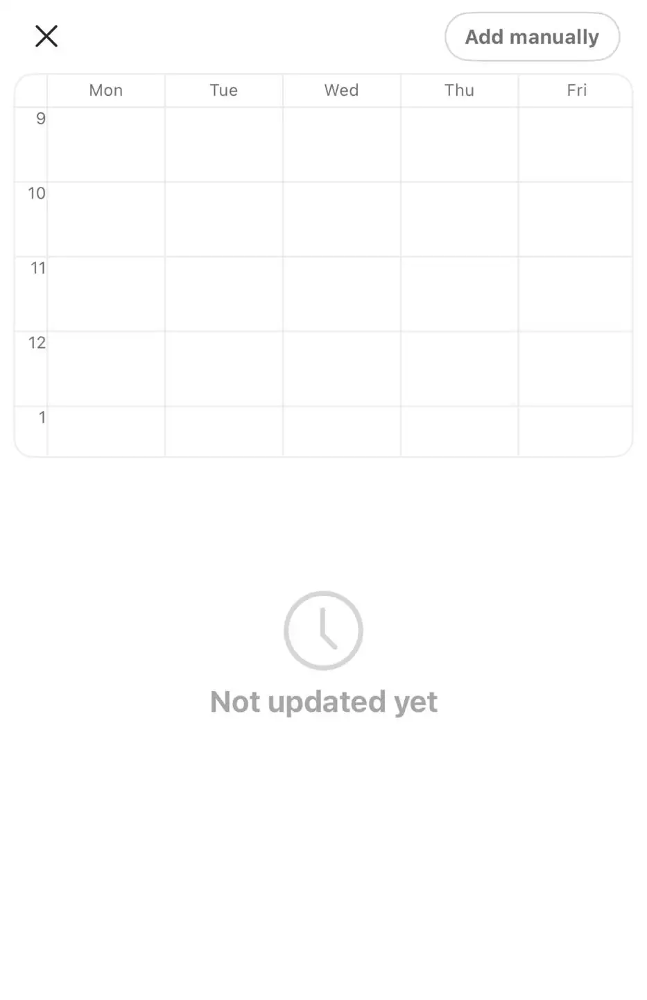
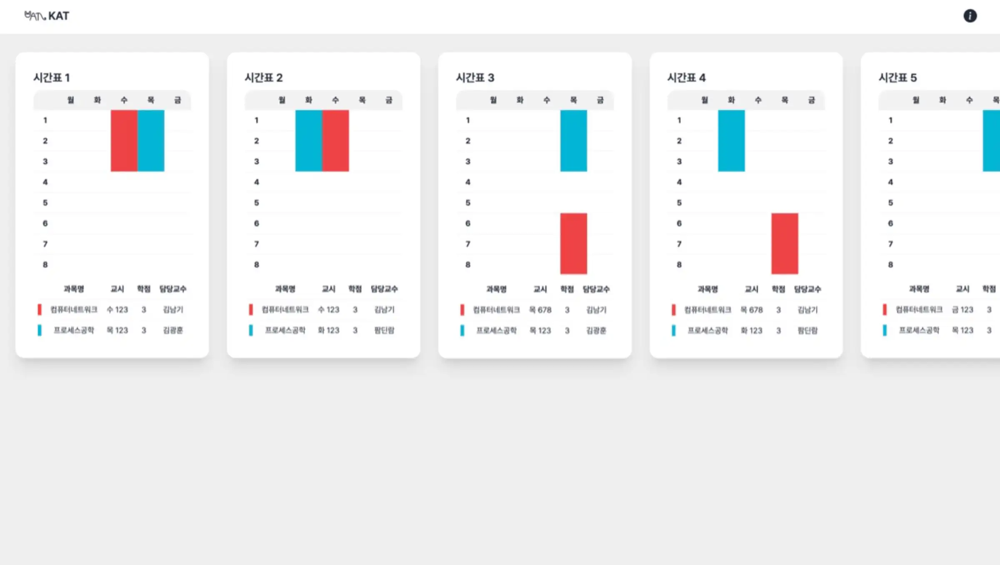
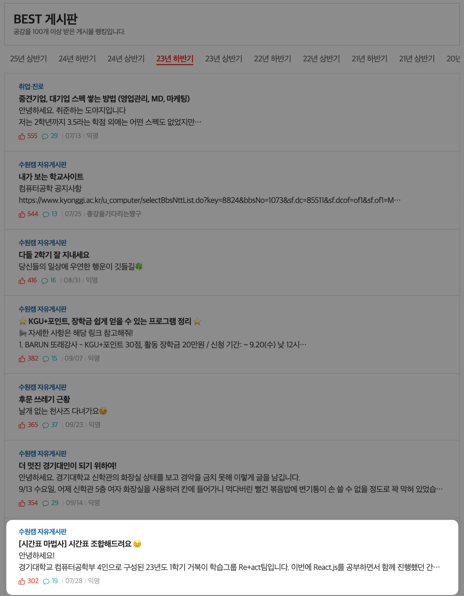
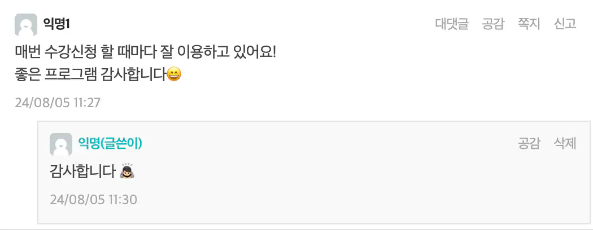
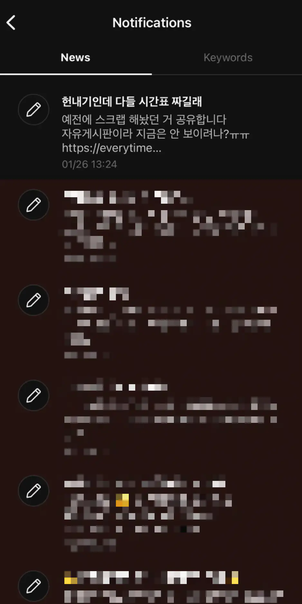
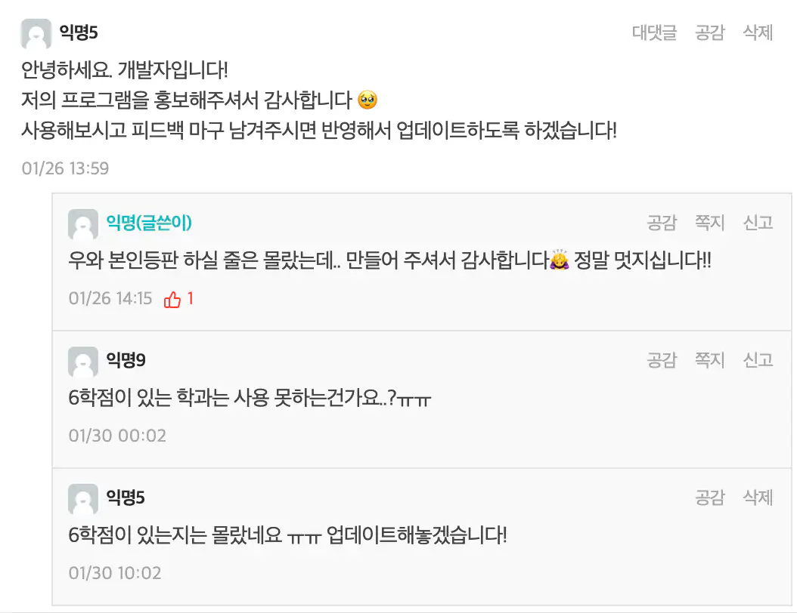

저에게는 [Auto Table(구 KAT)](https://auto-table.wontory.dev/)이라는 오래된 서비스가 있습니다.  
저의 첫 React 프로젝트였기도 했지만, 유의미한 성과도 얻게 되어 저에게는 큰 의미가 있는 프로젝트입니다.  
오늘은 **Auto Table**이라는 서비스의 개발 과정과 성과를 이야기해보려고 합니다.

## Auto Table이 뭔가요?

Auto Table은 대학생들의 희망 강의들을 조합하여 가능한 모든 경우의 시간표 정보를 제공하는 서비스입니다.  
비슷한 서비스로는 **에브리타임**의 **시간표 마법사**가 있습니다.

### 그럼 에브리타임의 시간표 마법사를 쓰면 되는 것 아닌가요?
네, 맞습니다.

에브리타임은 각 대학으로부터 API 혹은 Excel 시트 형태로 개설될 과목에 대한 정보를 받습니다. 덕분에 강의평을 찾아보며 간편하게 시간표를 짜거나 시간표 마법사를 통해 가능한 조합을 확인할 수 있죠.

그럼에도 Auto Table을 제작하게 된 이유가 있습니다. 학교마다 제공하는 정보의 정책이 다르겠지만, 저희 학교의 경우는 어떤 이유에서인지 23년도부터 에브리타임의 시간표가 업데이트되지 않고 있었습니다.



학교에서 보안을 이유로 외부에 정보를 제공하지 않기 시작하면서 에브리타임의 시간표 관련 기능들은 상당히 제한적으로 이용할 수 있게 되었습니다.
총학생회에서 강의 정보를 모두 취합하여 에브리타임 측으로 제출하는 등의 시도가 있었지만, 모두 수작업인지라 길게 유지될 수 없었습니다.
그래서 저희 학교 학생들은 에브리타임의 시간표 마법사 기능을 사용할 수 없음은 물론, 앱 내에서 시간표를 만드는 것 조차 수기로 입력해야 했습니다.

Auto Table은 **학교에서 제공하는 정보에 의존하는 에브리타임의 시간표 기능의 문제점**을 해결하기 위해 현재 서비스되고 있습니다.

## Auto Table의 시작, KAT

Auto Table은 처음에 [KAT(Kyonggi University Automatic Timetable Generator)](https://github.com/wontory/kat-java)라는 이름으로 시작되었습니다.
22년도 8월(2학년), 방학 기간 중에 열린 Java 관련 비교과 프로그램을 이수하고 그 후속 활동으로 개최된 교내 개발 대회에 출품하여 금상을 수상한 작품입니다.

이 때는 에브리타임의 시간표가 업데이트가 잘 되고 있을 때여서 오로지 대회 출품을 목적으로 개발된 프로젝트였습니다.
시간표 조합 기능을 구현하기 위해서 강의 정보는 어떻게 입력받을지, 자료 구조는 어떻게 설계할지(객체지향), 시간표를 조합하는 알고리즘은 어떻게 구현할지 등을 고민했습니다.
Auto Table의 핵심 기능과 기획이 KAT 때 완성되었다고 볼 수 있을 것 같습니다.


(이제 갓 Java 기초를 배운 시기여서 GUI 개발은 꿈도 못꾸고 CLI를 기반으로 작동하도록 제작되었습니다.)

## React 기반의 KAT V2
23년도 1학기부터는 웹 개발자를 진로로 설정하고, 이를 위한 공부를 시작했습니다.
학교 동기들과 [Re+act](https://github.com/sweb-org/2023-REACT-BASIC)라는 학습 그룹을 만들고, 함께 React 강의를 수강하며 공부해나갔습니다.

하지만 강의를 듣고, 강의에서 진행하는 코드를 따라 치는 것만으로는 온전히 지식을 습득할 수 없다고 판단해서 학습과 동시에 개인 프로젝트를 시작했습니다.
그것이 KAT V2입니다.


KAT V2의 목표는 Java 버전의 KAT에서 가장 아쉬웠던 점인 Command Line 기반의 인터페이스를 공부한 React를 활용해 웹 기반의 GUI로 바꾸는 것이었습니다.
KAT V2를 제작하기 위해 Vite React와 Tailwind CSS, Tailwind CSS 기반의 컴포넌트 라이브러리인 daisyUI를 열심히 학습했던 기억이 납니다.

Java 버전의 KAT과 React로 제작된 KAT V2는 핵심 기능에는 차이가 없지만, GUI의 시각적인 변화는 매우 크게 다가왔습니다.
강의 정보를 입력하기 편해졌고, 생성된 시간표도 더 눈에 잘 들어왔습니다.



React 학습을 검증하며 진행했던 이 프로젝트는 비록 상태 관리를 고민할 실력도 없었고, 서버와의 상호작용 또한 없는 저수준의 단순한 애플리케이션이지만,
향후 저의 React 개발에 큰 자신감을 불어넣어 주었습니다.

이 프로젝트를 시작할 때에는 개인 학습용 프로젝트였기 때문에 배포할 생각은 따로 하지 않았었습니다.
하지만 학습 그룹을 마무리하면서 저희 그룹의 성과를 자랑하고 싶었고, 큰 용기를 내어 에브리타임의 자유 게시판을 통해 KAT을 홍보했습니다.
그리고 때마침(?) 에브리타임의 시간표 업데이트 또한 점점 늦어지다가 더이상 최신화되지 않기 시작했습니다.


그렇게 저의 첫 React 프로젝트는 너무 감사하게도 학교 커뮤니티를 통해 폭발적인 반응을 얻었습니다...  
**302개의 좋아요**와 **776개의 스크랩**을 받으며, **23년 하반기 BEST 게시판**의 **7번째 게시글**로 선정되었습니다.



## Auto Table 업데이트
그 이후로 KAT V2는 너무나도 잠잠했습니다...  
반짝 뜬 이후 점점 사람들에게 잊혀져 갔습니다. (그런줄 알았습니다. 하하!)

이대로 이 프로젝트를 그냥 두기에는 저 개인적으로 너무 아쉬운 마음이 들어서,  
2024년에 대대적인 업데이트를 진행해보기로 했습니다.

1. React 웹앱을 Next.js로 변경
    - 시간표 생성 로직을 Next.js의 서버로 은닉
2. 상태 관리 도구인 Jotai를 도입
    - Write-Only Atom을 구분하여 관리
3. Zod와 React Hook Form을 이용한 입력값 검증
4. 시간표의 셀을 병합하는 동적 테이블 생성
5. 시간표 조합을 정량적으로 평가하여 좋은 시간표를 추천
6. 모바일에서도 사용할 수 있는 편리한 UI
7. 시간표 이미지 다운로드

이렇게 7가지를 Major한 변경사항으로 잡고 프로젝트를 갈아엎었습니다.

코드도 많이 다듬었고, 2, 3, 4번 변경사항을 위한 스키마와 로직을 고민했습니다.

```tsx title="/src/schemas"
import { z } from 'zod'

export const lectureSchema = z.object({
  index: z.number(),
  professor: z.string().min(1, { message: '담당교수를 입력해주세요.' }),
  day: z.enum(['월', '화', '수', '목', '금'], {
    message: '요일은 월, 화, 수, 목, 금 중 하나여야 합니다.',
  }),
  time: z
    .string()
    .min(1, { message: '교시를 입력해주세요.' })
    .regex(/^\d+$/, { message: '교시는 숫자로 입력해주세요.' }),
})

export type Lecture = z.infer<typeof lectureSchema>

export const subjectSchema = z.object({
  index: z.number(),
  title: z.string().min(1, {
    message: '과목명을 입력해주세요.',
  }),
  credit: z.number().min(1).max(6),
  color: z.string(),
  lectures: z.array(lectureSchema),
})

export type Subject = z.infer<typeof subjectSchema>

export type Timetable = {
  index: number
  score: number
  tags: Tag[]
  combination: z.infer<typeof subjectSchema>[]
  timetable: (z.infer<typeof subjectSchema> | null)[][]
}
```

&nbsp;

```ts title="/src/atoms/subjects.ts"
import { atom } from 'jotai'

import type { Lecture } from '~/schemas/lecture'
import type { Subject } from '~/schemas/subject'

export const subjectsAtom = atom<Subject[]>([])

// Subject
export const createSubjectAtom = atom(null, (get, set, subject: Subject) => {
  set(subjectsAtom, [...get(subjectsAtom), subject])
})

export const updateSubjectAtom = atom(null, (get, set, subject: Subject) => {
  set(
    subjectsAtom,
    get(subjectsAtom).map((s) => (s.index === subject.index ? subject : s)),
  )
})

export const deleteSubjectAtom = atom(null, (get, set, subject: Subject) => {
  set(
    subjectsAtom,
    get(subjectsAtom).filter((s) => s.index !== subject.index),
  )
})

// Lecture
export const createLectureAtom = atom(null, (get, set, subject: Subject, lecture: Lecture) => {
  set(
    subjectsAtom,
    get(subjectsAtom).map((s) => (s.index === subject.index ? { ...s, lectures: [...s.lectures, lecture] } : s)),
  )
})

export const updateLectureAtom = atom(null, (get, set, subject: Subject, lecture: Lecture) => {
  set(
    subjectsAtom,
    get(subjectsAtom).map((s) =>
      s.index === subject.index
        ? { ...s, lectures: s.lectures.map((l) => (l.index === lecture.index ? lecture : l)) }
        : s,
    ),
  )
})

export const deleteLectureAtom = atom(null, (get, set, subject: Subject, lecture: Lecture) => {
  set(
    subjectsAtom,
    get(subjectsAtom).map((s) =>
      s.index === subject.index ? { ...s, lectures: s.lectures.filter((l) => l.index !== lecture.index) } : s,
    ),
  )
})
```

&nbsp;

```tsx title="/src/components/table.tsx"
export function Table({ timetable }: { timetable: Timetable }) {
  return (
    <table className="table-md table h-full w-full table-fixed bg-base-100 text-center">
      <thead>
        <tr>
          <th />
          {days.map((day, i) => (
            <th key={`th-${timetable.index}-${i}`}>{day}</th>
          ))}
        </tr>
      </thead>
      <tbody>
        {timetable.timetable.map((row, i) => (
          <tr key={`tr-${timetable.index}-${i}`}>
            <th>{i + 1}</th>
            {row.map((subject, j) =>
              subject !== null ? (
                (i > 0 ? JSON.stringify(timetable.timetable[i - 1][j]) !== JSON.stringify(subject) : true) && (
                  <td
                    key={`td-${timetable.index}-${i}-${j}`}
                    rowSpan={subject.credit}
                    className={cn(
                      backgroundColors.find((color) => color.includes(subject.color)),
                      textColors.find((color) => color.includes(subject.color)),
                      'p-1 text-xs',
                    )}
                  >
                    {subject.title}
                  </td>
                )
              ) : (
                <td key={`td-${timetable.index}-${i}-${j}`} />
              ),
            )}
          </tr>
        ))}
      </tbody>
    </table>
  )
}
```

그리고 비슷한 상황의 다른 대학의 학생들도 편하게 접근할 수 있도록 서비스 이름을 KAT에서 Auto Table로 변경했고, 에브리타임에 업데이트 소식을 전했습니다.


반응은 KAT의 첫 홍보만큼 뜨겁지는 않았지만, 기존 사용자 분들의 따뜻한 감사 인사도 받게 되어서 기분이 너무 좋았습니다.



## 최고의 달, 2월
그리고 올해 2월은 저에게 최고의 달이었습니다.
졸업을 앞두고 취업을 준비하느라 Auto Table을 잊고 지내고 있었는데, 에브리타임에서 알림이 울렸습니다.




누군가 저의 프로젝트를 공유했고, 핫게시글로 선정된 것이었습니다.
저는 내가 아닌 다른 사람이 나의 서비스를 홍보하고, 이로 인한 선순환이 생긴다는 것에 가슴이 너무 벅차올랐습니다. "나의 프로젝트가 무의미하지 않았구나"를 증명받은 기분이었습니다.

**저에게는 너무 큰 힘이 되었습니다.**

그리고 이 게시글은 또한 많은 방문객을 확보할 수 있게 해주었습니다.


2월 한 달 동안 1232번의 방문이 있었습니다.

실제 조합된 시간표를 확인한 경우는 419로 방문객의 1/3 정도 수치에 불과하지만, 저는 이런 경험이 처음이어서 너무 신이 났습니다.
Devices 지표를 보면서 모바일 사용자를 위해 UI를 변경하기를 잘했다는 생각도 들었습니다.



감사 인사를 남기고, 피드백을 부탁드렸습니다.
여러 사용자들의 요구사항을 받아들여 6학점 대응을 위해 기능을 수정하고, 과목 별 색상 지정 기능을 추가 개발했습니다.

## 앞으로는...

어떤 부분을 개선할 수 있을까 고민했습니다.

1. 강의 정보를 입력하는 과정이 너무 번거롭다.
  - Analytics에서 `/result` 페이지로의 이동이 1/3 수준인 원인이 여기에 있는 것 같다.
2. 과목 별로 지정할 수 있는 색이 너무 제한적이다.
  - 현재 daisyUI의 color token을 제공하고 있는데, Tailwind CSS Colors로의 확장이 필요할 것 같다.
  - 각 색깔 별로 시인성이 좋은 텍스트 색도 함께 고민해야 할 것 같다.
3. 좋은 시간표를 판단하는 더 다양한 척도를 반영해야 한다.
  - 서비스 내에서 수강 후기를 별점으로 남기고 이를 반영하는 등의 방법을 고민하고 있다.

앞으로는 위와 같은 사항들에 대한 해결책을 고민해볼 것 같습니다.
특히 3번을 고민하고 해결하는 과정이 아주 재미있을 것 같아 기대가 됩니다.

저의 서비스가 많은 분들에게 도움이 될 수 있어서 너무 기쁜 경험이었습니다.
저희 학교와 비슷한 상황의 다른 학교가 있다면 사용해보시고, 괜찮으시다면 홍보도 해주시면 너무 감사할 것 같습니다.

긴 글 읽어주셔서 감사합니다.

> ## 바로가기
> - [Auto Table](https://auto-table.wontory.dev/)
> - [GitHub](https://github.com/wontory/auto-table)