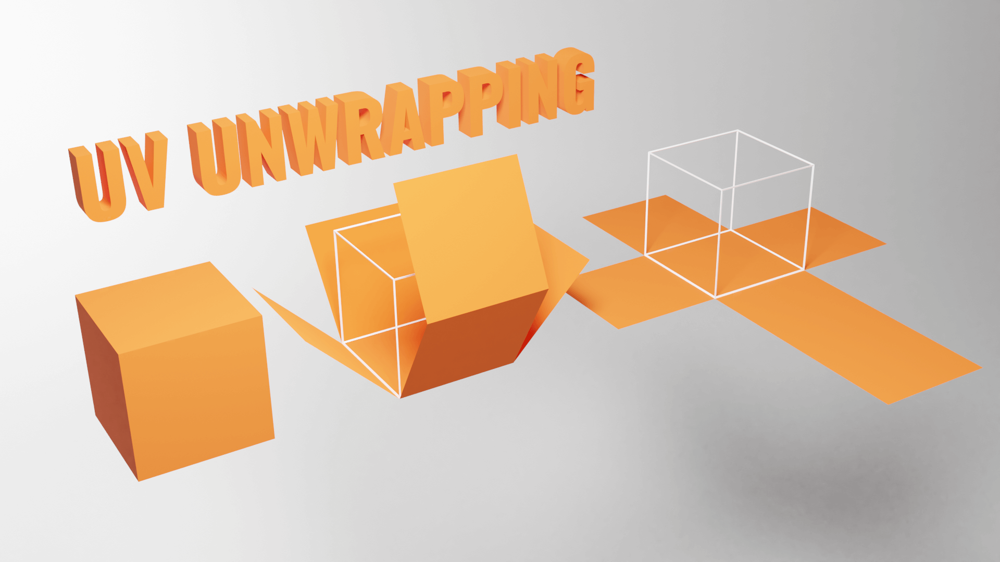
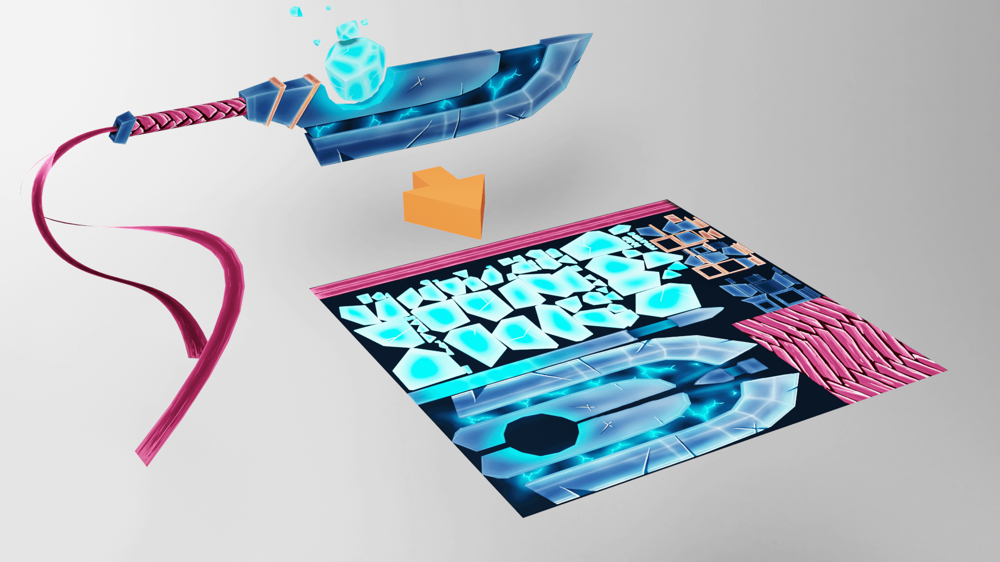
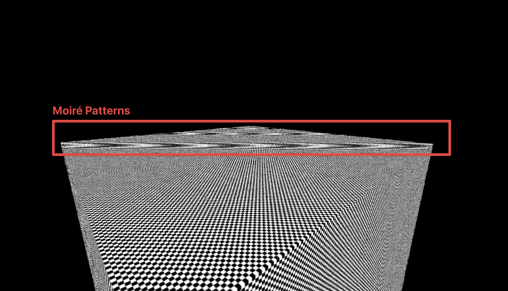
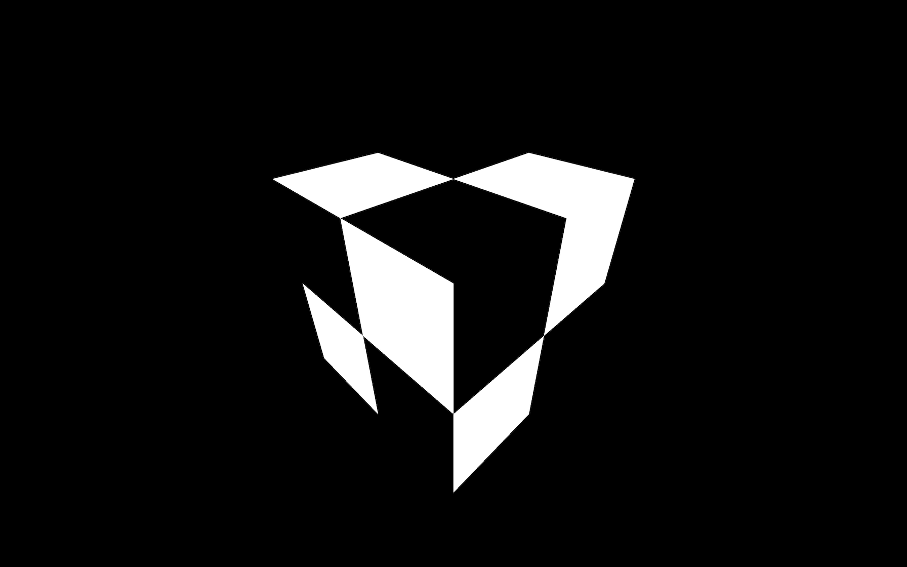

## Texture

Texture는 Geometry의 표면을 덮는 이미지입니다. 다양한 유형의 Texture는 색상 뿐만 아니라 Geometry의 외관에 다양한 효과를 줄 수 있습니다.

João Paulo의 [Door Texture](https://3dtextures.me/2019/04/16/door-wood-001/)를 통해 살펴보겠습니다.

&nbsp;

### Color(Albedo)

Texture의 픽셀을 가져와 Geometry에 적용합니다.


&nbsp;

### Alpha

Grayscale 이미지로, 흰색은 보이고 검은색은 보이지 않게 됩니다.


&nbsp;

### Height

Grayscale 이미지로, Vertex들을 이동시켜서 돌출을 만듭니다. 이 Texture를 사용하기 위해선 세분화(Subdivision, 단위 면적당 잘게 나눠서 표현하는 것)가 필요합니다.


&nbsp;

### Normal

Vertex들을 이동시키지 않고, 빛을 유도하여 면이 다르게 위치한 것처럼 보이게 만듭니다. Geometry를 세분화할 필요가 없어 성능적으로 좋으며, 디테일을 주기에 매우 유용합니다.


&nbsp;

### Ambient Occlusion

Grayscale 이미지로, 표면의 틈새에 가짜 그림자를 만듭니다. 물리적으로 정확하지는 않지만, 대비를 만드는데 도움이 됩니다.


&nbsp;

### Metalness

Grayscale 이미지로, 어떤 부분이 금속이고(흰색) 비금속인지(검은색) 지정합니다. 이 정보는 반사를 구현하는데 유용합니다.


&nbsp;

### Roughness

Metalness와 함께 사용되는 Grayscale 이미지로, 거친 정도를 지정합니다. 거칠수록 흰색으로 보이고, 부드러울수록 검은색으로 보입니다. 빛을 분산시키는데 도움이 되는 정보입니다.

예를 들면, 카펫은 매우 거칠어서 빛의 반사를 볼 수 없지만 물 표면은 매우 매끄러워서 빛이 반사됩니다.


&nbsp;

## PBR

이러한 Texture들은(특히 Metalness와 Roughness) PBR(Physically Based Rendering) 원칙들을 따릅니다.
PBR 원칙은 현실적인 결과를 얻기 위해 실제 세계의 지침을 따르는 여러 기법들을 모은 것입니다.

다양한 다른 기법들도 존재하지만, PBR은 많은 소프트웨어, 엔진, 라이브러리에서 사용되고 있으며 현실적인 렌더링의 표준이 되어가고 있습니다.

&nbsp;

## UV Unwrapping

BoxGeometry에 Texture를 배치하는 방법은 꽤 직관적이지만, 다른 Geometry에서는 까다로울 수 있습니다.
Texture가 다르게 늘어나거나 줄어들어 Geometry를 덮게 됩니다.

UV Unwrapping은 종이접기나 사탕 포장을 펼쳐서 평평하게 만드는 것으로 생각할 수 있습니다. 각 Vertex는 평면의 2D 좌표를 가집니다.



우리는 이 UV 2D 좌표를 `geometry.attributes.uv` 속성에서 실제로 확인할 수 있습니다.

```js
console.log(geometry.attributes.uv);
```

이 UV 좌표들은 Primitives를 사용하면 Three.js가 자동으로 생성합니다. Geometry를 직접 만들고 Texture를 적용하는 경우에는 UV 좌표를 직접 지정해줘야 합니다.


&nbsp;

## Filtering & Mipmapping

Mipmap은 Texture의 크기를 절반씩 줄여가며 1x1 크기의 텍스처가 될 때까지 여러 버전을 생성하는 기법입니다. 이 모든 Texture 변형들은 GPU로 전송되며, GPU는 가장 적합한 Texture 버전을 선택하게 됩니다.

Three.js와 GPU는 이미 이 모든 과정을 처리하고, 우리는 어떤 필터를 사용할지 설정하기만 하면 됩니다. 필터 알고리즘에는 Minification Filter와 Magnification Filter, 두 가지 유형이 있습니다.

&nbsp;

### Minification Filter

Minification Filter는 Texture의 픽셀이 렌더링되는 픽셀보다 작을 때 발생합니다. 다시 말해, Texture가 표면을 덮기에는 너무 크다는 의미입니다.

Texture의 Minification Filter는 `minFilter` 속성을 사용하여 변경할 수 있으며, 6가지 값을 사용할 수 있습니다.

- `NearestFilter`
- `LinearFilter`
- `NearestMipmapNearestFilter`
- `NearestMipmapLinearFilter`
- `LinearMipmapNearestFilter`
- `LinearMipmapLinearFilter` (기본값)

Filter를 적용하다보면 [무아레](https://ko.wikipedia.org/wiki/%EB%AC%B4%EC%95%84%EB%A0%88)라는 간섭 무늬을 보게 되는 경우가 있는데, 보통은 피하는 것이 좋습니다.



`minFilter` 속성에는 Mipmap을 사용해야만 합니다. 만약 `NearestFilter`를 사용한다면, Mipmap은 필요 없으며 이를 비활성화하려면 다음과 같이 설정할 수 있습니다.

```js
colorTexture.generateMipmaps = false;
colorTexture.minFilter = THREE.NearestFilter;
```

`NearestFilter`를 사용할 때, Mipmap을 비활성화하면 GPU의 부하가 약간 줄어듭니다.

&nbsp;

### Magnification Filter

Minification Filter와 비슷하지만, Texture의 픽셀이 렌더링되는 픽셀보다 클 때 발생합니다. 다시 말해, Texture가 표면을 덮기에 너무 작은 경우입니다.


매우 작은 Texture가 매우 큰 표면에 적용되면 흐릿하게 보일 수 있습니다. 처음에는 보기 싫을 수도 있지만, 더 나은 결과일 수 있습니다. 흐린 정도가 과도하지 않다면, 사용자는 인식하지 못할 것입니다.

Texture의 MagnificationFilter는 `magFilter` 속성을 사용해 변경할 수 있으며, 2가지 값을 사용할 수 있습니다.

- `NearestFilter`
- `LinearFilter` (기본값)

`NearestFilter`를 사용하면 기본 이미지를 그대로 유지하면서 Texture가 픽셀화된 모습을 볼 수 있습니다.



`NearestFilter`는 다른 필터들보다 처리 비용이 적기 때문에 더 나은 성능을 기대할 수 있습니다.

&nbsp;

## Texture 파일 형식과 최적화

Texture를 만들 때에는 다음 3가지 중요한 요소를 염두에 두어야 합니다.

&nbsp;

### 1. 파일 용량

웹사이트를 방문하는 사용자는 Texture를 다운로드해야 합니다. 웹에서 사용하는 대부분의 이미지 형식(`.jpg`, `.png` 등)을 사용할 수 있습니다.
JPG는 손실 압축 방식으로 일반적으로 파일 용량이 가벼운 반면, PNG는 무손실 압축 방식이지만 더 무겁습니다.

이미지를 가능한 한 가볍게 유지하면서도 적절한 품질을 유지할 수 있도록 압축 방법을 적용하세요.

&nbsp;

### 2. 이미지 크기

사용하는 각 Texture의 픽셀은 GPU에 저장되어야 하며, 이미지의 용량과 상관없이 GPU의 저장 용량은 제한적입니다.
더군다나 자동으로 생성되는 Mipmap으로 인해 저장해야 하는 픽셀 수가 더 많아집니다.

이미지 크기는 가능한 한 줄여야 합니다.

Mipmap에서 말했던 것처럼, Three.js는 Texture의 크기를 절반씩 줄여서 1x1 크기의 텍스처가 될 때까지 반복적으로 작은 버전을 생성합니다.
때문에 Texture의 가로 세로 크기는 반드시 2의 거듭제곱이어야 합니다. (512x512, 1024x1024, 512x2048 등)

만약 2의 거듭제곱이 아닌 크기를 가진 Texture를 사용한다면, Three.js는 가장 가까운 2의 거듭제곱 값으로 Texture를 늘리거나 축소하려고 시도할 것입니다.
이는 시각적으로 좋지 않은 결과를 초래할 수 있으며, 콘솔에서 경고 메시지도 출력됩니다.

&nbsp;

### 3. 데이터

Texture는 투명도를 지원합니다. JPG 파일은 알파 채널을 지원하지 않기 때문에 PNG 형식을 선호할 수 있습니다.
또는 알파 맵을 사용할 수도 있습니다.

Normal Texture를 사용하고 있다면, 각 픽셀의 빨강, 초록, 파랑 채널의 값이 정확해야 시각적인 오류가 발생하지 않습니다.
이를 위해 PNG를 사용해야 하며, PNG의 무손실 압축은 이러한 값들을 보존해줍니다.

&nbsp;

## Texture 파일 찾기

- https://www.poliigon.com/
- https://3dtextures.me/
- https://www.arroway-textures.ch/

포토샵과 같은 2D 소프트웨어를 사용하거나,  
Substance Designer같은 도구를 사용해서 Texture를 직접 만들 수도 있습니다.